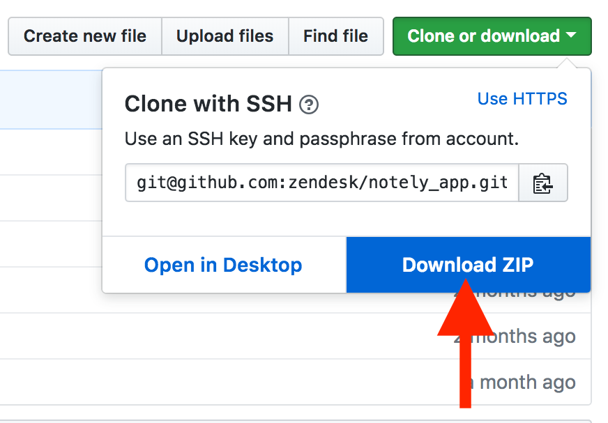
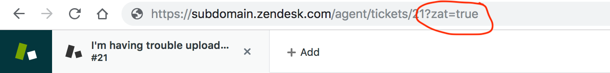
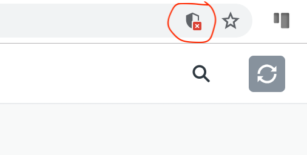
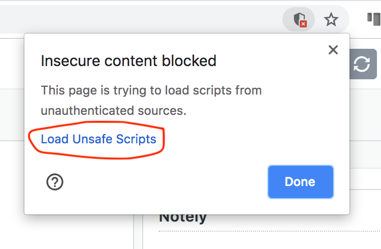

# Notely

Notely is a sample Zendesk App that allows you to record note events using the Events API.


## Table of Contents

* [Installing the app as is](#installing-the-app-as-is)
* [Local Development](#local-development)
* [Built With](#built-with)
* [License](#license)

## Installing the app as is

To run the app on your Zendesk subdomain

1. Download the zip of the app


2. Go to the Zendesk Support Manage Apps page on the Admin Settings page, and click the `Upload private app` button


3. Upload the downloaded zip


4. Install the app


## Local Development
Clone the repo and `cd` into the directory
```
git clone git@github.com:zendesk/notely_app.git && cd notely_app
```

Run the local dev server
```
zat server
```

Open a browser and go to your Zendesk subdomain. Append `?zat=true` to the end of your instance's url



Click the security icon that pops up.



Click load unsafe scripts




Happy Developing :)

## Built With

* [Zendesk App Framework](https://developer.zendesk.com/apps/docs/developer-guide/setup)

## License

This project is licensed under the Apache 2.0 License
